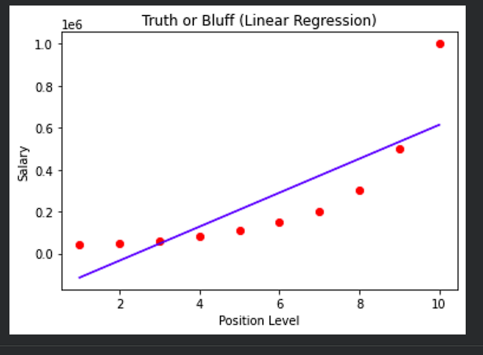
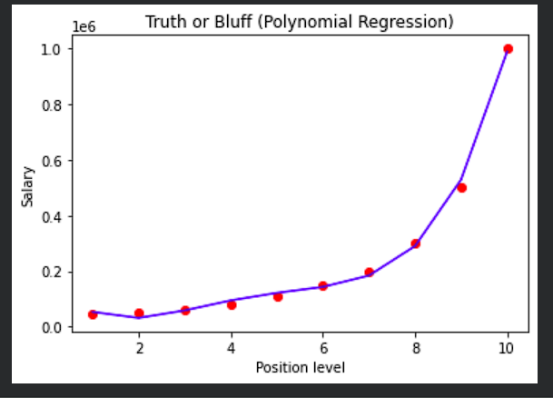

# PayPredict

A machine learning-based salary prediction system using Linear and Polynomial Regression.

## Features

- Predicts salary based on position level
- Uses Polynomial Regression
- Interactive user input
- Regression graph visualization

## Technologies Used

- Python
- NumPy
- pandas
- Matplotlib
- scikit-learn

## Screenshot





## How to Run

Install dependencies:

```bash
pip install -r requirements.txt

Run the Streamlit app:
streamlit run main.py
